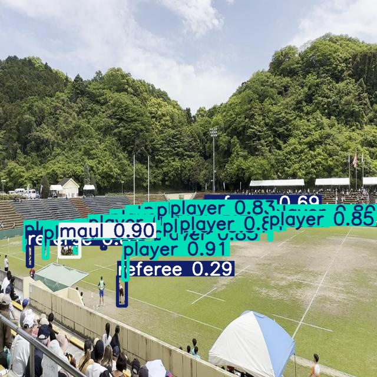

# AI-Powered Rugby Element Detection

## Project Overview

A computer vision system that detects and classifies key rugby elements (players, referees, rucks, scrums, balls, line outs, and mauls) with high precision using YOLOv5 architecture. The system achieves 90%+ precision with real-time inference capabilities (8.8ms per image).



## Technologies Used

- PyTorch
- YOLOv5
- Roboflow
- OpenCV
- Python 3.8+

## Dataset

- Custom annotated dataset of 2,100+ rugby images
- Classes: ball, line out, maul, player, referee, ruck, scrum
- Precision bounding box annotations

## Model Architecture

This project implements a fine-tuned YOLOv5 architecture with the following specifications:

- YOLOv5s as base model with transfer learning
- Input resolution: 640x640 pixels
- Batch size: 16
- Training for 100 epochs

## Results & Performance

### Overall Metrics

- **Precision:** 90%+ across all classes
- **Inference Speed:** 8.8ms per image
- **mAP@0.5:0.95:** Varied by class

### Class-Specific Performance

- **Strong performing classes:**
  - Scrum (mAP: 94.0%, precision: 91.6%, recall: 89.1%)
  - Player (mAP: 90.2%, precision: 92.8%, recall: 82.1%)
  - Referee (mAP: 90.1%, precision: 95.3%, recall: 80.0%)
  - Ruck (mAP: 86.0%, precision: 81.7%, recall: 85.6%)
- **Average performing classes:**
  - Line out (mAP: 56.8%, precision: 55.3%, recall: 64.3%)
  - Ball (mAP: 46.1%, precision: 72.1%, recall: 25.4%)
- **Weak performing classes:**
  - Maul (mAP: 12.5%, precision: 12.4%, recall: 12.9%)

## Implementation Workflow

### 1. Dataset Acquisition and Setup

- Acquired the dataset via Roboflow
- Set up YOLOv5 environment and properly configured data paths
- Created appropriate data.yaml configuration file

### 2. Model Training

- Implemented training pipeline with appropriate hyperparameters
- Trained using GPU acceleration
- Monitored training metrics and saved checkpoints

### 3. Model Evaluation

- Evaluated the model on a test dataset
- Generated confusion matrix and precision-recall curves
- Calculated class-specific performance metrics

### 4. Inference on New Images

- Created a testing pipeline for new rugby images
- Implemented visualization of detection results

## Technical Challenges & Solutions

### Challenge: Small Object Detection

**Problem:** The rugby ball was difficult to detect consistently due to its small size in many frames.
**Solution:** Applied focused data augmentation techniques specifically for images containing balls, including random scaling and rotation.

### Challenge: Class Imbalance

**Problem:** Player detections significantly outnumbered other classes like mauls and line outs.
**Solution:** Implemented weighted loss function to give higher importance to underrepresented classes.

### Challenge: Distinguishing Similar Classes

**Problem:** Mauls, rucks, and scrums can appear visually similar in certain camera angles.
**Solution:** Enhanced the dataset with more diverse examples of each formation type and additional annotation quality checks.

## Future Improvements

- Collect more training data for maul and ball classes
- Train with a larger model (YOLOv5m, YOLOv5l)
- Add more data augmentation to increase variety
- Fine-tune model parameters specifically for small object detection
- Implement tracking to maintain consistent detections across video frames

## Installation & Usage

```bash
# Clone repository
git clone https://github.com/YOUR_USERNAME/rugby-element-detection.git
cd rugby-element-detection

# Set up environment
pip install -r requirements.txt

# Run inference on sample image
python detect.py --source sample.jpg --weights models/best.pt
```
